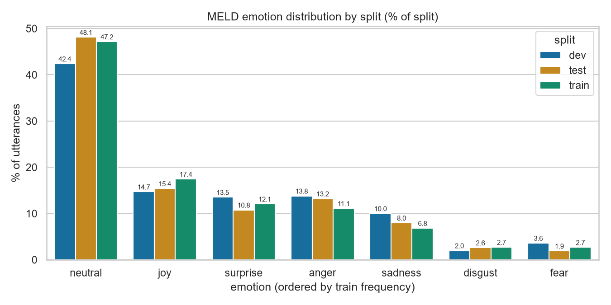
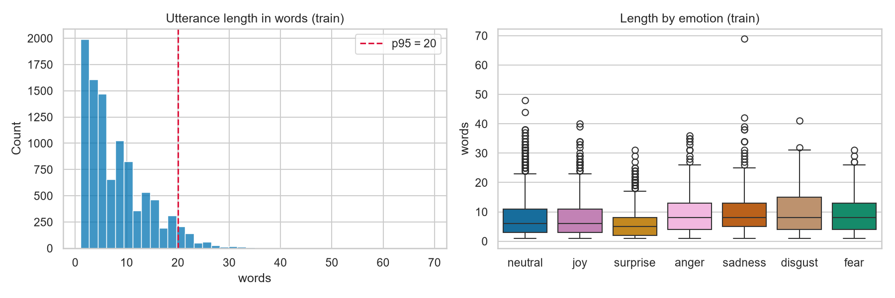
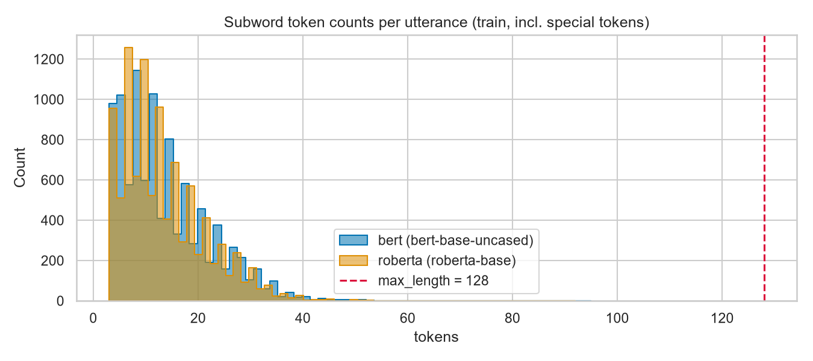

# Fine-tuning Transformers for Emotion Classification on MELD

**Task:** multi-class text classification — emotion detection (assignment option 1a)
**Models compared:** `bert-base-uncased` vs `roberta-base`
**Primary metric:** weighted F1

All numbers, tables, and figures in this report are produced by the notebooks in
`notebooks/` and read from `results/`; nothing here is recomputed by hand.

---

## 1. Task & objectives

The goal is to classify a single conversational utterance into one of **seven
emotions** — neutral, joy, surprise, anger, sadness, disgust, fear — using only
its text. Concretely, the objectives are:

1. Fine-tune two pretrained transformer encoders on the same task and data.
2. Compare them fairly under an identical training and tuning protocol.
3. Tune hyperparameters systematically rather than by guesswork, and report the
   search, not just the winner.
4. Analyse *where* the models fail, not only how often.

The interesting tension in this task is that it is **imbalanced and
context-starved**: one class accounts for nearly half the data, and the inputs
are single lines of dialogue averaging eight words. Both properties shape every
decision below.

## 2. Dataset

**MELD** (Multimodal EmotionLines Dataset; Poria et al., ACL 2019) contains
utterances from the TV series *Friends*, each annotated with an emotion and a
sentiment. MELD is multimodal — it ships audio and video — but this study uses
the **text annotations only**, which is the assignment's scope and also the
source of the ceiling discussed in §8.

The corpus ships **official train/dev/test splits**, which we use unchanged:

| Split | Utterances | Dialogues | Speakers |
|---|---|---|---|
| train | 9,989 | 1,038 | 260 |
| dev | 1,109 | 114 | 47 |
| test | 2,610 | 280 | 100 |

### Why we did not create our own split

The assignment asks for a train/dev/test split. MELD already provides one, and
we keep it deliberately for two reasons:

1. **Comparability.** Every published MELD baseline reports on these splits.
   Re-splitting would make our numbers incomparable to the literature we
   position against in §8.
2. **Leakage.** The official splits are drawn from disjoint episodes. A random
   re-split would scatter utterances from the *same conversation* across train
   and test, letting the model see a dialogue's context at training time and
   inflating scores.

### Class distribution

| Emotion | train | dev | test |
|---|---|---|---|
| neutral | 4,710 (47.1%) | 470 (42.4%) | 1,256 (48.1%) |
| joy | 1,743 (17.4%) | 163 (14.7%) | 402 (15.4%) |
| surprise | 1,205 (12.1%) | 150 (13.5%) | 281 (10.8%) |
| anger | 1,109 (11.1%) | 153 (13.8%) | 345 (13.2%) |
| sadness | 683 (6.8%) | 111 (10.0%) | 208 (8.0%) |
| disgust | 271 (2.7%) | 22 (2.0%) | 68 (2.6%) |
| fear | 268 (2.7%) | 40 (3.6%) | 50 (1.9%) |

This is the defining property of the dataset: a **17.6× imbalance ratio**
between neutral (4,710) and fear (268). A model that answers "neutral" to
everything scores **47.2% accuracy** while being completely useless. That single
fact justifies two decisions:

- **Weighted F1 is the primary metric**, with **macro F1 reported alongside** to
  expose rare-class performance that weighted F1 averages away. Accuracy is
  reported only for completeness.
- The loss is **class-weighted** (§3).

Label ids are fixed once in `src/utils.py`, ordered by descending train
frequency (`neutral=0 … fear=6`), so that the training and evaluation notebooks
cannot disagree about which id means which emotion.

### Utterance length

| Split | mean words | median | p95 | max |
|---|---|---|---|---|
| train | 7.95 | 6 | 20 | 69 |
| dev | 7.91 | 6 | 20 | 37 |
| test | 8.21 | 7 | 21 | 45 |

A median of **six words**. Many utterances ("What?", "Hey.") carry no emotional
signal in isolation at all — their gold label comes from dialogue context and
vocal delivery that a text-only model never observes. §8 returns to this.

## 3. Preprocessing

### Text normalization — and a correction to a common assumption

MELD's CSVs are widely reported to contain **mojibake** (UTF-8 text mis-decoded
as Latin-1, so `’` appears as `’`). We checked this explicitly rather than
assuming it, and **this copy of MELD has no mojibake at all** — zero markers
across all three splits. The check remains in notebook 01 because the failure
mode is silent.

`ftfy.fix_text` is still applied, but for a different and honestly-stated
reason: it **uncurls typographic punctuation to ASCII** (`’`→`'`, `…`→`...`,
`—`→`--`). This matters because the curly apostrophe is by far the most common
non-ASCII character in the corpus (3,547 occurrences in train), almost all of
them inside contractions, and both tokenizers have better-represented vocabulary
entries for `don't` than for `don’t`. Combined with whitespace collapsing, this
normalized ~30% of train utterances.

### Integrity

No nulls in either the utterance or emotion columns. Empty utterances (after
cleaning) are dropped; **duplicates are kept deliberately** — repeated one-word
lines like "Hey." are legitimate dialogue, and removing them would break
comparability with published baselines that use the splits as shipped.

### Tokenization (step 4a)

Each model uses **its own** tokenizer — this is part of what is being compared:

| | `bert-base-uncased` | `roberta-base` |
|---|---|---|
| Algorithm | WordPiece | byte-level BPE |
| Vocab size | 30,522 | 50,265 |
| Case | lowercased | preserved |
| Marks | `##` = continuation piece | `Ġ` = preceding space |
| `[UNK]` possible | yes | no (any byte is representable) |

The difference is not academic on this corpus:

| Utterance | BERT | RoBERTa |
|---|---|---|
| `PIVOT! PIVOT! PIVOT!` | `pi ##vot ! pi ##vot ! pi ##vot !` (9) | `P IV OT ! ĠP IV OT ! ĠP IV OT !` (12) |
| `Whaaaat? Noooo way...` | `w ##ha ##aa ##at ? no ##oo ##o way . . .` (12) | `Wh aaa at ? ĠNo ooo Ġway ...` (8) |

*Friends* dialogue is full of shouted capitals and elongated vowels. BERT
**discards the casing outright** — the shout `PIVOT!` and a calm `pivot` become
the same token sequence — while RoBERTa preserves it (at the cost of more
tokens). Casing is plausibly an emotion signal, which is a concrete, testable
reason to expect the two models to differ.

### `max_length`

`max_length = 128` truncates **zero** train utterances under either tokenizer.
Because padding is **dynamic** (`DataCollatorWithPadding` pads each batch to its
own longest member, ~12 tokens median, not to 128), this generous ceiling costs
almost no compute while eliminating truncation as a confounding variable.

### Imbalance handling (step 4c)

Three options were considered:

1. **Oversample rare classes** — duplicating ~270 fear/disgust utterances ~17×
   invites the model to memorize them verbatim rather than generalize.
2. **Undersample neutral** — discards thousands of real utterances from a corpus
   that is already small (~10k).
3. **Class-weighted loss** — leaves the data exactly as shipped and rescales
   each class's contribution to the gradient.

We chose **option 3**. It alters no data, adds no runtime, keeps the official
splits comparable to published work, and is the standard low-risk choice under a
time budget. Weights use the inverse-frequency form
`w_c = n_samples / (n_classes · count_c)`, computed on **train only** (using dev
or test counts would leak information about the evaluation sets), and were
cross-checked against scikit-learn's `balanced` weights:

| Emotion | train count | weight |
|---|---|---|
| neutral | 4,710 | 0.303 |
| joy | 1,743 | 0.819 |
| surprise | 1,205 | 1.184 |
| anger | 1,109 | 1.287 |
| sadness | 683 | 2.089 |
| disgust | 271 | 5.266 |
| fear | 268 | 5.325 |

Its known cost — a bias toward over-predicting rare classes (recall up,
precision down) — is checked against the per-class results in §8.

## 4. Models

Both models are **English** (matching the data) and in the **same size class**
(~110–125M parameters, 12 layers, 768 hidden), which is what makes the
comparison fair: any difference is attributable to *pretraining*, not capacity.

- **`bert-base-uncased`** — the reference point for this literature. Pretrained
  with masked-LM + next-sentence prediction on BooksCorpus + English Wikipedia.
  Lowercased.
- **`roberta-base`** — same architecture, deliberately different pretraining:
  NSP dropped, dynamic masking, ~10× more data (160GB, including CC-News and
  OpenWebText), larger batches, longer training. Case-sensitive.

RoBERTa is the natural comparison because it isolates *pretraining recipe* while
holding architecture fixed. Two properties make it a priori promising here: its
web/news-heavy pretraining is closer to conversational register than Wikipedia,
and it preserves the casing that carries shouted emphasis in this corpus.

## 5. Fine-tuning setup

Full fine-tuning (all parameters updated) with a classification head over the
pooled `[CLS]`/`<s>` representation, `num_labels=7`.

| Setting | Value |
|---|---|
| Loss | class-weighted cross-entropy (§3) |
| Precision | bf16 |
| Optimizer | AdamW (Trainer default) |
| LR schedule | linear decay, warmup ratio 0.06 |
| Weight decay | 0.01 |
| Max epochs | 5, best-epoch selection on dev |
| Model selection | `load_best_model_at_end`, `metric_for_best_model="weighted_f1"` |
| Seed | 42 (Python, NumPy, torch, Trainer, data order) |
| Hardware | RTX 5070 (12 GB, Blackwell sm_120), torch 2.13+cu132 |

The identical protocol is applied to both models — same splits, same weights,
same grid, same seed, same selection rule — so the comparison in §7 is not
confounded by tuning effort.

**Model selection uses dev only.** The test split is untouched until §7; it is
first read in notebook 04.

<!-- Sections 6-9 are written once the grid and test evaluation complete. -->

