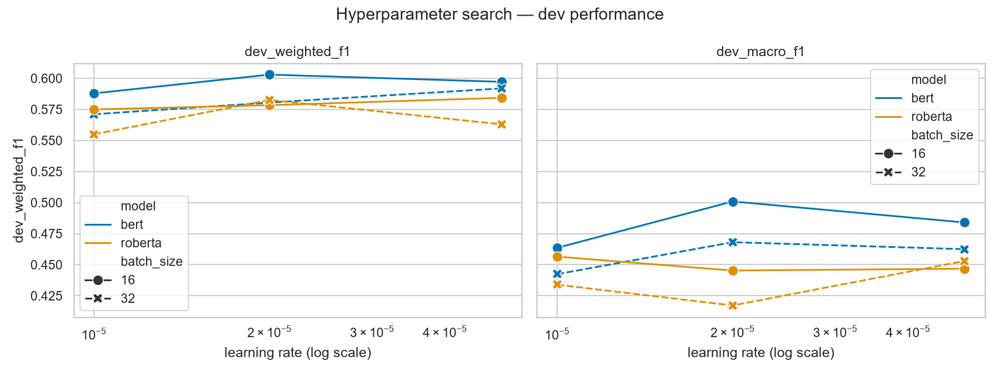
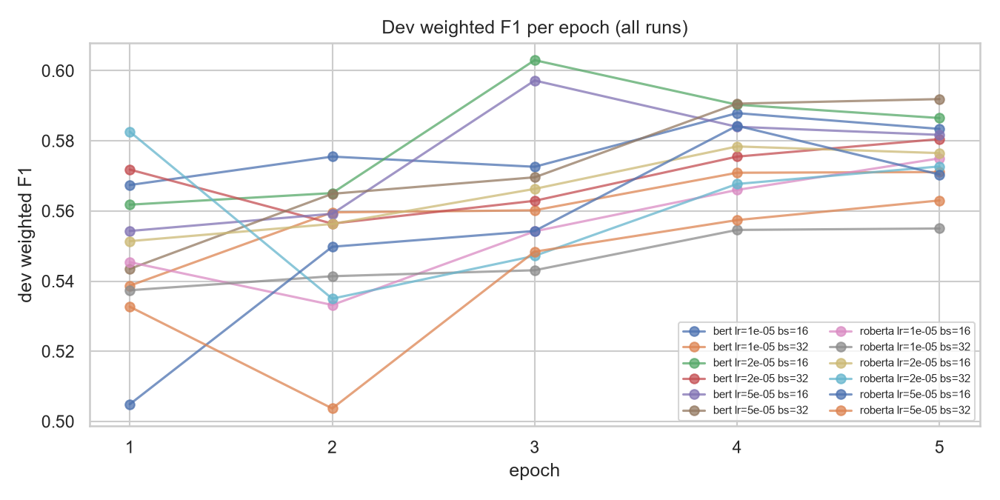
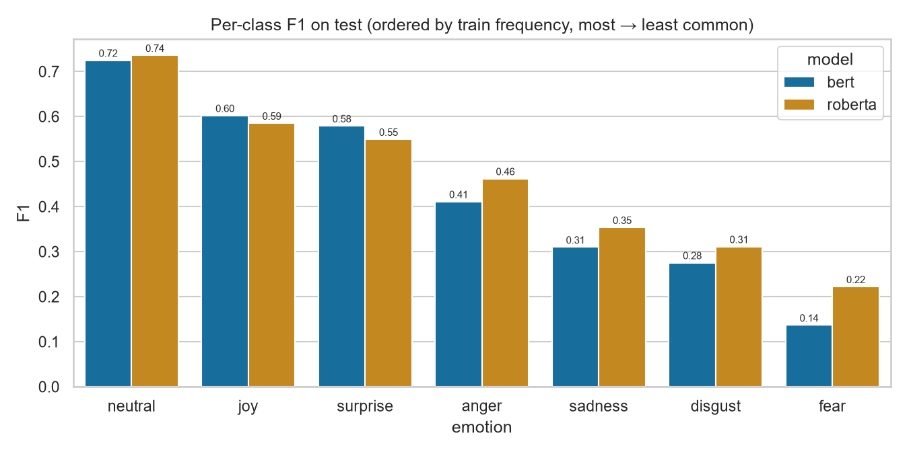
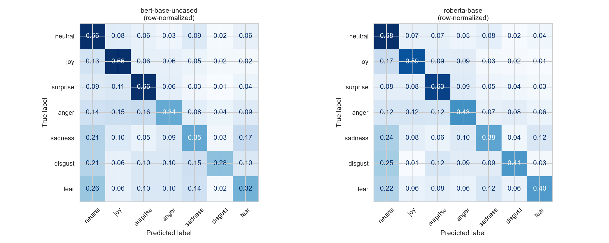

# Fine-tuning Transformers for Emotion Classification on MELD

**Task:** multi-class text classification — emotion detection (assignment option 1a)
**Models compared:** `bert-base-uncased` vs `roberta-base`
**Primary metric:** weighted F1

All numbers, tables, and figures in this report are produced by the notebooks in
`notebooks/` and read from `results/`; nothing here is recomputed by hand.

---

## 1. Task & objectives

The goal is to classify a single conversational utterance into one of **seven
emotions** — neutral, joy, surprise, anger, sadness, disgust, fear — using only
its text. Concretely, the objectives are:

1. Fine-tune two pretrained transformer encoders on the same task and data.
2. Compare them fairly under an identical training and tuning protocol.
3. Tune hyperparameters systematically rather than by guesswork, and report the
   search, not just the winner.
4. Analyse *where* the models fail, not only how often.

The interesting tension in this task is that it is **imbalanced and
context-starved**: one class accounts for nearly half the data, and the inputs
are single lines of dialogue averaging eight words. Both properties shape every
decision below.

## 2. Dataset

**MELD** (Multimodal EmotionLines Dataset; Poria et al., ACL 2019) contains
utterances from the TV series *Friends*, each annotated with an emotion and a
sentiment. MELD is multimodal — it ships audio and video — but this study uses
the **text annotations only**, which is the assignment's scope and also the
source of the ceiling discussed in §8.

The corpus ships **official train/dev/test splits**, which we use unchanged:

| Split | Utterances | Dialogues | Speakers |
|---|---|---|---|
| train | 9,989 | 1,038 | 260 |
| dev | 1,109 | 114 | 47 |
| test | 2,610 | 280 | 100 |

### Why we did not create our own split

The assignment asks for a train/dev/test split. MELD already provides one, and
we keep it deliberately for two reasons:

1. **Comparability.** Every published MELD baseline reports on these splits.
   Re-splitting would make our numbers incomparable to the literature we
   position against in §8.
2. **Leakage.** The official splits are drawn from disjoint episodes. A random
   re-split would scatter utterances from the *same conversation* across train
   and test, letting the model see a dialogue's context at training time and
   inflating scores.

### Class distribution

| Emotion | train | dev | test |
|---|---|---|---|
| neutral | 4,710 (47.1%) | 470 (42.4%) | 1,256 (48.1%) |
| joy | 1,743 (17.4%) | 163 (14.7%) | 402 (15.4%) |
| surprise | 1,205 (12.1%) | 150 (13.5%) | 281 (10.8%) |
| anger | 1,109 (11.1%) | 153 (13.8%) | 345 (13.2%) |
| sadness | 683 (6.8%) | 111 (10.0%) | 208 (8.0%) |
| disgust | 271 (2.7%) | 22 (2.0%) | 68 (2.6%) |
| fear | 268 (2.7%) | 40 (3.6%) | 50 (1.9%) |


This is the defining property of the dataset: a **17.6× imbalance ratio**
between neutral (4,710) and fear (268). A model that answers "neutral" to
everything scores **47.2% accuracy** while being completely useless. That single
fact justifies two decisions:

- **Weighted F1 is the primary metric**, with **macro F1 reported alongside** to
  expose rare-class performance that weighted F1 averages away. Accuracy is
  reported only for completeness.
- The loss is **class-weighted** (§3).

Label ids are fixed once in `src/utils.py`, ordered by descending train
frequency (`neutral=0 … fear=6`), so that the training and evaluation notebooks
cannot disagree about which id means which emotion.

### Utterance length

| Split | mean words | median | p95 | max |
|---|---|---|---|---|
| train | 7.95 | 6 | 20 | 69 |
| dev | 7.91 | 6 | 20 | 37 |
| test | 8.21 | 7 | 21 | 45 |


A median of **six words**. Many utterances ("What?", "Hey.") carry no emotional
signal in isolation at all — their gold label comes from dialogue context and
vocal delivery that a text-only model never observes. §8 returns to this.

## 3. Preprocessing

### Text normalization — and a correction to a common assumption

MELD's CSVs are widely reported to contain **mojibake** (UTF-8 text mis-decoded
as Latin-1, so `’` appears as `’`). We checked this explicitly rather than
assuming it, and **this copy of MELD has no mojibake at all** — zero markers
across all three splits. The check remains in notebook 01 because the failure
mode is silent.

`ftfy.fix_text` is still applied, but for a different and honestly-stated
reason: it **uncurls typographic punctuation to ASCII** (`’`→`'`, `…`→`...`,
`—`→`--`). This matters because the curly apostrophe is by far the most common
non-ASCII character in the corpus (3,547 occurrences in train), almost all of
them inside contractions, and both tokenizers have better-represented vocabulary
entries for `don't` than for `don’t`. Combined with whitespace collapsing, this
normalized ~30% of train utterances.

### Integrity

No nulls in either the utterance or emotion columns. Empty utterances (after
cleaning) are dropped; **duplicates are kept deliberately** — repeated one-word
lines like "Hey." are legitimate dialogue, and removing them would break
comparability with published baselines that use the splits as shipped.

### Tokenization (step 4a)

Each model uses **its own** tokenizer — this is part of what is being compared:

| | `bert-base-uncased` | `roberta-base` |
|---|---|---|
| Algorithm | WordPiece | byte-level BPE |
| Vocab size | 30,522 | 50,265 |
| Case | lowercased | preserved |
| Marks | `##` = continuation piece | `Ġ` = preceding space |
| `[UNK]` possible | yes | no (any byte is representable) |

The difference is not academic on this corpus:

| Utterance | BERT | RoBERTa |
|---|---|---|
| `PIVOT! PIVOT! PIVOT!` | `pi ##vot ! pi ##vot ! pi ##vot !` (9) | `P IV OT ! ĠP IV OT ! ĠP IV OT !` (12) |
| `Whaaaat? Noooo way...` | `w ##ha ##aa ##at ? no ##oo ##o way . . .` (12) | `Wh aaa at ? ĠNo ooo Ġway ...` (8) |

*Friends* dialogue is full of shouted capitals and elongated vowels. BERT
**discards the casing outright** — the shout `PIVOT!` and a calm `pivot` become
the same token sequence — while RoBERTa preserves it (at the cost of more
tokens). Casing is plausibly an emotion signal, which is a concrete, testable
reason to expect the two models to differ.

### `max_length`


`max_length = 128` truncates **zero** train utterances under either tokenizer.
Because padding is **dynamic** (`DataCollatorWithPadding` pads each batch to its
own longest member, ~12 tokens median, not to 128), this generous ceiling costs
almost no compute while eliminating truncation as a confounding variable.

### Imbalance handling (step 4c)

Three options were considered:

1. **Oversample rare classes** — duplicating ~270 fear/disgust utterances ~17×
   invites the model to memorize them verbatim rather than generalize.
2. **Undersample neutral** — discards thousands of real utterances from a corpus
   that is already small (~10k).
3. **Class-weighted loss** — leaves the data exactly as shipped and rescales
   each class's contribution to the gradient.

We chose **option 3**. It alters no data, adds no runtime, keeps the official
splits comparable to published work, and is the standard low-risk choice under a
time budget. Weights use the inverse-frequency form
`w_c = n_samples / (n_classes · count_c)`, computed on **train only** (using dev
or test counts would leak information about the evaluation sets), and were
cross-checked against scikit-learn's `balanced` weights:

| Emotion | train count | weight |
|---|---|---|
| neutral | 4,710 | 0.303 |
| joy | 1,743 | 0.819 |
| surprise | 1,205 | 1.184 |
| anger | 1,109 | 1.287 |
| sadness | 683 | 2.089 |
| disgust | 271 | 5.266 |
| fear | 268 | 5.325 |

Its known cost — a bias toward over-predicting rare classes (recall up,
precision down) — is checked against the per-class results in §8.

## 4. Models

Both models are **English** (matching the data) and in the **same size class**
(~110–125M parameters, 12 layers, 768 hidden), which is what makes the
comparison fair: any difference is attributable to *pretraining*, not capacity.

- **`bert-base-uncased`** — the reference point for this literature. Pretrained
  with masked-LM + next-sentence prediction on BooksCorpus + English Wikipedia.
  Lowercased.
- **`roberta-base`** — same architecture, deliberately different pretraining:
  NSP dropped, dynamic masking, ~10× more data (160GB, including CC-News and
  OpenWebText), larger batches, longer training. Case-sensitive.

RoBERTa is the natural comparison because it isolates *pretraining recipe* while
holding architecture fixed. Two properties make it a priori promising here: its
web/news-heavy pretraining is closer to conversational register than Wikipedia,
and it preserves the casing that carries shouted emphasis in this corpus.

*How this prediction fared:* partially. RoBERTa does win on test, and its
advantage is concentrated exactly where extra pretraining should help most — the
rare classes (§7). But it **lost on dev**, and the margins are small enough
(0.012–0.019) that §8 declines to call the comparison settled.

## 5. Fine-tuning setup

Full fine-tuning (all parameters updated) with a classification head over the
pooled `[CLS]`/`<s>` representation, `num_labels=7`.

| Setting | Value |
|---|---|
| Loss | class-weighted cross-entropy (§3) |
| Precision | bf16 |
| Optimizer | AdamW (Trainer default) |
| LR schedule | linear decay, warmup ratio 0.06 |
| Weight decay | 0.01 |
| Max epochs | 5, best-epoch selection on dev |
| Model selection | `load_best_model_at_end`, `metric_for_best_model="weighted_f1"` |
| Seed | 42 (Python, NumPy, torch, Trainer, data order) |
| Hardware | RTX 5070 (12 GB, Blackwell sm_120), torch 2.13+cu132 |

The identical protocol is applied to both models — same splits, same weights,
same grid, same seed, same selection rule — so the comparison in §7 is not
confounded by tuning effort.

**Model selection uses dev only.** The test split is untouched until §7; it is
first read in notebook 04.

## 6. Hyperparameter experiments (step 7)

### The grid and why these values

| Hyperparameter | Values | Justification |
|---|---|---|
| learning rate | 1e-5, 2e-5, 5e-5 | spans the range the BERT paper recommends for fine-tuning; above ~5e-5 fine-tuning tends to diverge, below ~1e-5 it underfits within a few epochs |
| batch size | 16, 32 | BERT-paper defaults; both fit 12 GB at seq len 128 in bf16. Crossed with lr rather than tuned separately, because the two interact |
| epochs | ≤5, best epoch selected on dev | MELD is small (~10k), so overfitting appears by epoch 3–4. Selecting the best epoch on dev makes epochs a *tuned* quantity without a separate run per value |

`warmup_ratio=0.06` and `weight_decay=0.01` were **held fixed** so the grid
isolates the lr × batch-size interaction. Warmup stabilizes the first few
hundred steps, when the randomly initialized head sends large gradients into the
pretrained encoder; the decay value is the standard BERT default.

### Full search results

All 12 runs, ≤5 epochs each. Complete table: `results/hparam_search.csv`.

| model | lr | batch | best epoch | dev weighted F1 | dev macro F1 | wall (s) |
|---|---|---|---|---|---|---|
| bert | 1e-5 | 16 | 4 | 0.5879 | 0.4636 | 141.5 |
| bert | 1e-5 | 32 | 5 | 0.5711 | 0.4424 | 78.3 |
| **bert** | **2e-5** | **16** | **3** | **0.6030** | **0.5009** | 140.1 |
| bert | 2e-5 | 32 | 5 | 0.5805 | 0.4681 | 72.5 |
| bert | 5e-5 | 16 | 3 | 0.5972 | 0.4840 | 134.7 |
| bert | 5e-5 | 32 | 5 | 0.5919 | 0.4625 | 73.1 |
| roberta | 1e-5 | 16 | 5 | 0.5750 | 0.4565 | 138.7 |
| roberta | 1e-5 | 32 | 5 | 0.5550 | 0.4339 | 75.7 |
| roberta | 2e-5 | 16 | 4 | 0.5784 | 0.4453 | 143.6 |
| roberta | 2e-5 | 32 | 1 | 0.5826 | 0.4172 | 76.7 |
| **roberta** | **5e-5** | **16** | **4** | **0.5843** | **0.4468** | 144.8 |
| roberta | 5e-5 | 32 | 5 | 0.5630 | 0.4530 | 77.0 |



**Best config per model (selected on dev weighted F1):**

| Model | lr | batch | epoch | dev weighted F1 | dev macro F1 |
|---|---|---|---|---|---|
| `bert-base-uncased` | 2e-5 | 16 | 3 | 0.6030 | 0.5009 |
| `roberta-base` | 5e-5 | 16 | 4 | 0.5843 | 0.4468 |

### What the search actually shows

**Which knob mattered more?** Almost equally little. The mean spread in dev
weighted F1 across learning rates (holding model and batch fixed) is **0.018**;
across batch sizes (holding model and lr fixed) it is **0.015**. The *entire*
grid spans 0.555–0.603 — a 0.048 range. Neither hyperparameter is decisive, and
the honest summary is that this task is not very sensitive to either within the
recommended ranges.

**Batch 16 beat batch 32 in 5 of 6 pairings** — but this is partly an artifact,
and reporting it as a clean finding would be wrong. Every bs=32 run peaks at
**epoch 5**, the last epoch we allow, and is still improving when training
stops. bs=32 performs half as many optimizer steps per epoch, so under a fixed
5-epoch budget it is **under-trained rather than inferior**. The batch-size
effect here is confounded with the epoch cap. Separating them would require
matching runs by optimizer steps rather than epochs — noted in §8 as future work.



**Learning rate behaves as the BERT paper predicts.** At lr=1e-5 both models
peak at epoch 4–5 and are still climbing — the underfitting end. At 2e-5 and
5e-5, bs=16 runs peak at epoch 3–4 and then decline, the expected overfitting
signature on a ~10k corpus. Best-epoch-on-dev selection is doing real work: had
we fixed epochs at 5, the best BERT config would have scored 0.5865 instead of
0.6030.

**One run needs flagging.** `roberta lr=2e-5 bs=32` "won" its trace at
**epoch 1** (0.5826), then dropped and never recovered
(0.5826 → 0.5350 → 0.5472 → 0.5677 → 0.5727). Its macro F1 is the *worst* in the
grid (0.4172), which is the tell: a high weighted F1 with poor macro F1 means
the epoch-1 model was leaning on the majority class. This is best-epoch
selection picking up a noise spike, not a good model — an argument for selecting
on macro F1 in imbalanced settings, or for requiring a minimum epoch count.

## 7. Results (step 8)

Both models evaluated on the **test split (2,610 utterances), used exactly once**.

| Model | weighted F1 | macro F1 | accuracy |
|---|---|---|---|
| majority baseline (always neutral) | 0.3127 | 0.0928 | 0.4812 |
| `bert-base-uncased` (lr 2e-5, bs 16) | 0.5928 | 0.4343 | 0.5759 |
| **`roberta-base`** (lr 5e-5, bs 16) | **0.6050** | **0.4599** | **0.5908** |

The baseline comparison is the important context: the majority baseline reaches
**48.1% accuracy** while being worthless (macro F1 0.093). Both models roughly
**quintuple macro F1** over it. Reporting accuracy alone would make a useless
model look two-thirds as good as a working one.

Both models land inside the **published text-only MELD range of roughly
57–65% weighted F1**, so these are credible, in-family results rather than a
broken pipeline.

### The dev→test ranking flipped

This is the most important result in the report, and it is a negative one:

| | dev weighted F1 | test weighted F1 |
|---|---|---|
| `bert-base-uncased` | **0.6030** | 0.5928 |
| `roberta-base` | 0.5843 | **0.6050** |

**BERT won on dev; RoBERTa won on test.** The two gaps are ~0.019 and ~0.012 —
in opposite directions. From a single seed, with dev at only 1,109 utterances,
the correct conclusion is not "RoBERTa is better" but **"this experiment does
not separate these two models."** RoBERTa's advantage on test (+0.012 weighted,
+0.026 macro) is real in the numbers but smaller than the run-to-run variation
we should expect, and the dev result points the other way.

Settling it would take multiple seeds per configuration and a significance test
over the differences — the single most valuable next experiment (§8).

### Per-class breakdown



| Emotion | test support | BERT F1 | RoBERTa F1 |
|---|---|---|---|
| neutral | 1,256 | 0.725 | 0.736 |
| joy | 402 | 0.602 | 0.585 |
| surprise | 281 | 0.579 | 0.549 |
| anger | 345 | 0.411 | 0.462 |
| sadness | 208 | 0.310 | 0.354 |
| disgust | 68 | 0.275 | 0.311 |
| fear | 50 | 0.137 | 0.222 |

Performance tracks class frequency almost monotonically — from neutral (0.73) to
fear (0.14–0.22). **The gap between the models is not uniform**: BERT is
slightly ahead on the two commonest emotional classes (joy, surprise), while
RoBERTa is ahead on all four rarest (anger, sadness, disgust, fear), most
visibly on fear (0.222 vs 0.137, a 62% relative gain). RoBERTa's macro-F1
advantage is therefore driven **specifically by rare classes** — consistent with
its larger and more varied pretraining giving it more to work with where task
data is thinnest.

### Confusion matrices



Row-normalized, so cell (i, j) reads "of all true class-i utterances, what
fraction were predicted j". Normalizing by row is what makes rare classes
legible — in raw counts fear (50 utterances) is invisible beside neutral (1,256).

**Top 3 confusion pairs by rate:**

| BERT | | RoBERTa | |
|---|---|---|---|
| fear → neutral | 26.0% (13) | disgust → neutral | 25.0% (17) |
| sadness → neutral | 20.7% (43) | sadness → neutral | 23.6% (49) |
| disgust → neutral | 20.6% (14) | fear → neutral | 22.0% (11) |

Every top confusion for both models is **X → neutral**. The plan anticipated
anger↔disgust and joy↔surprise confusions; those exist but are not dominant.
The real structure is simpler and more one-sided: **rare emotions collapse into
neutral**, which is what a 47%-neutral prior does to classes with a few hundred
training examples.

The error budget is more surprising in the other direction:

| | total errors | predicted neutral when it wasn't | true neutral misread as emotion |
|---|---|---|---|
| BERT | 1,107 | 195 (17.6%) | 431 (38.9%) |
| RoBERTa | 1,068 | 208 (19.5%) | 404 (37.8%) |

**Roughly twice as many errors are true-neutral-misread-as-emotion (~38%) as are
emotion-flattened-to-neutral (~18%.)** The class-weighted loss did not merely
fail to stop neutral collapse — it overcorrected, making the models too *eager*
to find emotion in neutral lines. That leads directly to §8.

## 8. Analysis (step 9)

### Did class weighting work?

Yes, and the cost is exactly the one predicted in §3 — larger than expected.

The weighted loss was supposed to trade precision for recall on rare classes.
It did, dramatically. For `roberta-base` on fear: **recall 0.400, precision
0.154**. The model finds 40% of fear utterances, but **five out of six
utterances it labels "fear" are not fear**. The same pattern holds for disgust
(recall 0.412, precision 0.250) and sadness (recall 0.375, precision 0.335).
Across both models, every class rarer than joy shows recall exceeding precision;
every class commoner than it shows the reverse (neutral: precision 0.80, recall
0.68).

So the weighting is doing precisely what inverse-frequency weighting does — a
5.3× multiplier on fear's loss buys recall by making the model trigger-happy.
Whether that trade is *worth it* depends on the application, and this is the
honest verdict: for a 50-utterance class, a weighted model at F1 0.22 is barely
better than an unweighted model that ignores fear entirely, and it costs
neutral precision. **A milder weighting (e.g. `sqrt` of inverse frequency)
would likely land better** — the untested middle ground between our two
extremes.

The plan proposed an unweighted ablation to confirm this. It was not run (§8,
limitations), so the claim above rests on the precision/recall structure rather
than a direct comparison — a real gap.

### Which model wins?

**On this evidence, neither convincingly.** RoBERTa wins the test split on all
three metrics (weighted F1 +0.012, macro F1 +0.026, accuracy +0.015) and is
better on every rare class. BERT won the dev split by a similar margin. With one
seed per configuration, a 0.012 test gap and a contradicting dev signal, the
defensible statement is that RoBERTa is **mildly preferable, mostly for
rare-class recall**, and that the difference is not established.

If forced to ship one: **RoBERTa**, on the strength of the macro-F1 and
rare-class advantage, which is where the task is actually hard.

Note also that the two models chose **different optimal learning rates** (BERT
2e-5, RoBERTa 5e-5). RoBERTa needed the largest rate in the grid, and it sits at
the edge of our range — its true optimum may lie outside it. Our grid may
therefore under-serve RoBERTa slightly, which cuts against the "BERT is better"
reading of the dev result.

### Which hyperparameter mattered?

Neither much (spread 0.018 for lr, 0.015 for batch size, against a 0.048 total
grid range). The strongest lever was not in the grid at all: **best-epoch
selection**, worth 0.017 on the winning BERT config alone — comparable to the
entire effect of learning rate.

### Error analysis, and a hypothesis this study refuted

We expected short, context-free utterances ("What?", "Hey.") to be the hardest
cases, since their emotion lives in delivery and dialogue context a text-only
model never sees. **We tested it and it is false.**

| | n | accuracy | macro F1 | neutral recall | non-neutral recall |
|---|---|---|---|---|---|
| ≤ 3 words | 715 | **0.660** | **0.491** | 0.691 | 0.630 |
| > 3 words | 1,895 | 0.544 | 0.414 | 0.643 | 0.453 |

Short utterances are **easier**, by 11.6 accuracy points. Two obvious
explanations were checked and ruled out:

1. *"They're more often neutral, and the model leans neutral."* No — the neutral
   share is near-identical (49.0% vs 47.8%).
2. *"It's a class-mix artifact."* No — short utterances score higher on **macro
   F1**, which is insensitive to class mix, and higher on **both** neutral and
   non-neutral recall.

The likelier explanation is that short emotional lines in *Friends* are
**formulaic and lexically explicit** — "Oh my God!", "I'm so sorry" — where the
emotion word essentially *is* the utterance. Longer turns dilute the emotional
cue across a sentence of mixed content.

**The context limitation is real, but it is not about length.** The honest
evidence for it is different: **24 distinct strings appear in the test split
with more than one gold label**, affecting **155 utterances (5.9% of test)**.
`"Hey!"` alone appears as anger, joy, neutral, sadness, *and* surprise.

```
'Are you sure?'  -> [neutral, surprise]
'Good.'          -> [joy, neutral]
'Hey!'           -> [anger, joy, neutral, sadness, surprise]
'Hi!'            -> [joy, neutral, sadness]
'Huh?'           -> [anger, neutral]
```

This is an **irreducible ceiling**: identical input cannot produce two different
outputs, so a text-only model is provably wrong on some fraction of these no
matter how good it is. It is a floor on the error rate that no amount of
fine-tuning removes — and a concrete reason why text-only MELD results plateau
in the high 50s / low 60s, exactly where ours landed.

High-confidence errors (`results/error_examples.csv`) show the same story from
the other side: the model is confidently wrong on lines that read as neutral in
isolation but were delivered with emotion.

### Limitations

Stated plainly, because several bear on how much to trust the numbers above:

1. **Single seed per configuration.** The headline model comparison rests on
   differences (0.012–0.019) plausibly smaller than seed variance, and the dev
   and test splits disagree on the ranking. This is the study's biggest weakness.
2. **The batch-size result is confounded** with the 5-epoch cap: every bs=32 run
   was still improving when training stopped.
3. **No unweighted ablation.** The class-weighting analysis is inferred from
   precision/recall structure, not measured against a no-weights control.
4. **No LoRA comparison.** Planned as optional; not run.
5. **Text only.** MELD ships audio and video. The 5.9% ambiguous-string figure
   is a lower bound on what the other modalities would resolve.
6. **No dialogue context.** Each utterance is classified in isolation, though
   MELD provides `Dialogue_ID` and utterance order.
7. **RoBERTa's optimum may lie outside the grid** — it chose the largest lr we
   offered (5e-5).

### What we'd do with more time

In descending order of expected value:

1. **Multiple seeds (3–5) per config + a significance test.** Nothing else in
   this list matters until we know whether the BERT/RoBERTa gap is real. This is
   also cheap: ~2 minutes per run.
2. **Add dialogue context** — prepend the previous 1–3 utterances. This attacks
   the ceiling identified above and is the single change most likely to move the
   numbers, since it is what the published context-aware MELD models exploit.
3. **Tune the weighting strength** rather than accepting full inverse-frequency:
   sqrt-inverse weighting, or focal loss, to recover the precision the current
   scheme spends.
4. **Select on macro F1, not weighted F1**, or require a minimum epoch — this
   would have prevented the `roberta 2e-5 bs=32` epoch-1 noise spike.
5. **Re-run the batch-size comparison matched by optimizer steps**, to
   de-confound it from the epoch cap.
6. **LoRA**, for the efficiency comparison the plan proposed.

## 9. Reproduction

Full setup, environment, and commands: **[`README.md`](README.md)**.

In short:

```bash
uv pip install torch --index-url https://download.pytorch.org/whl/cu128   # Blackwell sm_120
uv pip install -r requirements.txt
python scripts/download_data.py
python src/training.py                    # the 12-run grid (~25 min on an RTX 5070)
jupytext --to ipynb notebooks/*.py
jupyter nbconvert --to notebook --execute --inplace notebooks/0*.ipynb
```

Seeded throughout (`SEED = 42`). Exact GPU reproducibility is not guaranteed —
cuDNN kernel selection and non-deterministic reductions introduce small
variation, which is part of why §8's first recommendation is multiple seeds.

The MELD CSVs are not redistributed in this repo (GPL-3.0);
`scripts/download_data.py` fetches them from the authors' repository.

> Poria, S., Hazarika, D., Majumder, N., Naik, G., Cambria, E., & Mihalcea, R.
> (2019). MELD: A Multimodal Multi-Party Dataset for Emotion Recognition in
> Conversations. *ACL 2019*. <https://github.com/declare-lab/MELD>

